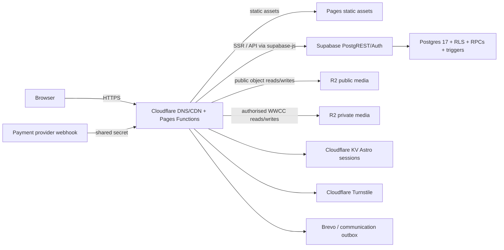

# Production readiness audit — 2026-07-29

Audit scope: repository source, production build, connected Supabase project `qzqezldtklimtupajvxf`, connected Cloudflare account and Pages project, current official platform documentation, production HTTP responses, and production-safe read-only SQL. No production writes, schema changes, migrations, load tests, commits, pushes, or deployments were performed.

## Executive summary

The platform has a sound small-club architecture and several unusually good safety controls: all exposed application tables have RLS enabled, sensitive writes generally use permission-checked database functions, money-like checkout paths lock rows and use unique idempotency keys, WWCC files are held in a non-public R2 bucket, public uploads are type/size/dimension checked, and server responses have appropriate security and cache headers.

It is not yet ready for an unrestricted whole-club launch. The principal blockers are recoverability and partial multi-system writes. Supabase is on the Free plan, which has no managed database backups or PITR. Neither R2 bucket has retention/lock protection. Child-account creation can leave an Auth user and partial profile/family records when a later write fails, and its wallet insert error is ignored.

Measured production traffic also shows that public `Cache-Control` headers are not creating Cloudflare edge cache hits: the homepage returns `CF-Cache-Status: DYNAMIC`. It performs eight Supabase calls in three waves. The first controlled homepage request took 1.047 seconds to first byte; later samples ranged from 0.065 seconds Worker time to 0.675 seconds end-to-end. This is acceptable for small traffic but creates avoidable database amplification during a burst.

Capacity decisions:

| Concurrent use | Decision | Basis |
|---|---|---|
| 25 | Ready with minor improvements | Current data is tiny, calls are bounded per request, and transaction RPCs are sound. Backup and child-account fixes are still required before relying on the system. |
| 50 | Ready with minor improvements | Likely technically viable, but public request amplification and free-plan Auth/email behavior should be corrected. |
| 100 | Unable to determine without load testing | The design can plausibly support it, but no staging concurrency results exist and homepage misses amplify to about 800 Supabase calls for 100 simultaneous requests. |
| 250 | Unable to determine without load testing | Free-plan compute, uncached SSR, Auth email limits, and unmeasured write contention make a claim unsafe. |

Finding count: **2 critical, 8 high, 10 medium, and 4 low**.

Final readiness decision: **Ready after Phase 0 and Phase 1**.

## Evidence and limitations

Verified:

- Supabase organization plan: `free`; project region `ap-southeast-2`; Postgres 17.6.
- Cloudflare zone plan: `Free Website`; Pages Functions use the bundled/free usage model.
- Database size: approximately 20 MB.
- Production public-table row counts: currently very small (largest application table is `role_permissions` at about 105 rows).
- `pg_stat_statements` is installed and was queried.
- Supabase security and performance advisors were queried.
- Cloudflare Pages configuration, bindings, buckets, domains, lifecycle rules, and deployment metadata were inspected.
- Selected RLS reads were executed in read-only transactions as an ordinary member and a super administrator.
- Representative public routes were requested once serially; this was not a load test.

Unable to verify with available access:

- Hosted Supabase Auth rate-limit values, custom SMTP configuration, and email delivery capacity.
- Supabase dashboard compute graphs, peak historical connections, egress, and backup/PITR screen.
- Cloudflare account billing usage and Pages Functions CPU/subrequest history.
- Authenticated browser metrics for portal/admin pages; no test credentials were used.
- Full role-runtime tests for child, parent, coach, manager, volunteer, canteen staff, and registrar because production contains no representative accounts for most roles.
- Core Web Vitals traces: the Chrome DevTools performance MCP required by the performance skill was unavailable. Build size and controlled HTTP timing evidence are reported instead.

Capacity is therefore a recommendation, not a guarantee.

## Architecture map

Runtime database access uses `@supabase/supabase-js`/PostgREST over HTTPS. The application does not open direct Postgres connections per request, so it does not create a serverless connection-pool leak. PostgREST/Supabase manages the database connections. There are no browser service-role keys.

## Complete application inventory

### Public website

Public/static or mostly static routes:

- `/about/`, `/canteen/`, `/community/`, `/contact/`, `/gallery/`, `/join/`, `/merchandise/`, `/volunteer/`
- `/forgot-password/`, `/login/`, `/reset-password/`, `/signup/`

Dynamic public routes:

- `/`, `/news/`, `/news/[slug]/`, `/events/`, `/social/`, `/sponsors/`
- `/teams/`, `/teams/[slug]/`, `/weekly-highlights/`, `/sitemap.xml`

Public data sources are Astro content plus `content_articles`, `club_announcements`, `sponsors`, `club_events`, `club_event_ticket_types`, `teams`, `seasons`, `competitions`, `team_players`, `team_staff`, `social_profiles`, and `social_posts`.

### Member portal

- Dashboard and account: `/portal/`, `/portal/account/`, `/portal/roles/`
- Teams: `/portal/teams/`, `/portal/teams/[id]/`, `/portal/notice-board/`
- Family/wallet: `/portal/family/`, `/portal/vouchers/`
- Events: `/portal/events/`, `/portal/events/[slug]/`
- Canteen: `/portal/canteen/`, `/portal/canteen/shop/`, cart, checkout, order detail, staff view
- Merchandise: `/portal/merchandise/`, `/portal/shop/`, cart, checkout, order detail
- Coaching and volunteers: `/portal/coaching/`, `/portal/coaching/[slug]/`, `/portal/volunteers/`

Every portal request first performs `auth.getUser()` and `get_portal_context()`. Within one request this is memoized by a `WeakMap`, so components do not repeat session loading.

### Administration

- Overview, users and roles
- Teams, players and family records
- Content, news, highlights, social hub, sponsors
- Events and tickets
- Canteen and merchandise
- Wallets
- Volunteers/WWCC
- Coaching resources

### Server/API endpoints

There are more than 60 write endpoints under:

- `/api/auth/*`
- `/api/portal/*`
- `/api/admin/*`
- `/api/webhooks/payments`
- `/api/workers/communication-outbox`
- `/api/wwcc-document`

Authentication flows include email signup/confirmation, password login, password recovery using `token_hash` and `verifyOtp`, global signout after password change, and managed child username login.

### Database and background objects

Production contains 80+ public tables. Important groups are:

- identity: `profiles`, `roles`, `permissions`, `role_permissions`, `user_role_assignments`
- audit/compliance: `audit_logs`, `role_assignment_history`, `member_compliance`, `wwcc_submissions`, `file_records`
- club structure: `seasons`, `competitions`, `teams`, `team_players`, `team_staff`, `player_records`
- family: `families`, `family_members`, `family_relationship_invitations`, `managed_child_accounts`
- team board: `team_posts`, reactions, poll options/responses, reads, match reports
- money: wallets, immutable ledger entries, vouchers/redemptions/reversals, payments/webhook events
- commerce: canteen and merchandise products, carts, orders, items, status history
- events/tickets, volunteers, coaching, public content, social, notifications/outbox

The communication outbox has a protected worker endpoint using claim/complete/fail RPCs. No Cloudflare Cron trigger is configured in the Pages project, so dispatch depends on an external/manual caller unless another scheduler exists outside the inspected configuration.

### Cloudflare bindings and environment

Production Pages binds:

- KV `SESSION`
- R2 `PUBLIC_MEDIA_BUCKET`
- R2 `PRIVATE_MEDIA_BUCKET`
- Supabase URL and secret/public keys
- Turnstile keys
- Brevo key and email sender settings

The payment handler expects `PAYMENT_WEBHOOK_SECRET`, but that variable is absent from the inspected production Pages environment. The handler therefore fails closed with 503.

Observability is enabled in repository Wrangler configuration, but the live project is Cloudflare Pages and Web Analytics is disabled.

## Current strengths

- All listed public and storage tables have RLS enabled.
- Runtime RLS test: an ordinary member saw one own profile, one own wallet, one own role assignment, no audit logs, and lacked `users.manage`/`wwcc.verify`; a super administrator saw all three profiles/wallets, six role assignments, 24 audit events, and had both permissions.
- `anon` lacks direct `profiles` table privileges.
- WWCC R2 bucket has no public `r2.dev` or custom domain; documents are streamed only after owner/reviewer checks and forced attachment headers.
- Recovery cookies and Supabase SSR cookies are `HttpOnly`, `Secure` on HTTPS, and `SameSite=Lax`.
- Middleware rejects cross-site state-changing API requests using `Origin` and `Sec-Fetch-Site`.
- CSP, HSTS, nosniff, frame, referrer, and permissions headers are present.
- Auth forms use Turnstile and reset responses are enumeration-safe.
- Public image validation allows JPEG/PNG/WebP/AVIF, checks signatures and dimensions, rejects SVG, and enforces route-specific limits.
- Private WWCC files allow a narrow MIME/extension set and are stored under generated keys.
- Wallet balances are derived by `app_private.wallet_balance_cents()` from immutable ledger entries rather than stored as a separately mutable authoritative balance.
- Wallet, voucher, canteen, merchandise, and ticket operations predominantly use transactional RPCs, row locks, check constraints, and unique idempotency keys.
- Payment webhook events have a unique `(provider, provider_event_id)` constraint.
- Canteen checkout has unique customer/idempotency protection and validates non-negative monetary state.
- General signup provisioning occurs in the same Auth insert transaction through `on_auth_user_created`; profile and general-role writes are idempotent.
- The server calls PostgREST rather than opening a direct Postgres connection per request.
- Private responses and any request carrying cookies are `private, no-store`.

## Critical findings

### C1 — No production-grade database or object recovery

**Evidence:** Supabase organization plan is Free. Current Supabase documentation states Free projects do not receive managed automatic backups and PITR is unavailable. Both R2 buckets have only the default multipart-abort lifecycle rule and no lock/retention rules. Supabase database backups would not restore R2 objects anyway.

**Impact:** accidental deletion, a bad privileged action, corruption, or account compromise can permanently remove member, wallet, order, WWCC metadata, or files.

**Correction:** before broad launch, either move Supabase to Pro for seven-day daily backups or implement encrypted scheduled logical dumps to an independent location. Independently copy/version R2 objects and export Pages/Supabase configuration. Test restore to an isolated project.

**Migration/downtime:** no migration; plan change or operational job. Restore tests require an isolated environment, not production downtime.

### C2 — Managed child creation is not atomic and ignores wallet failure

**Evidence:** `src/pages/api/portal/child-account.ts` creates an Auth user, then performs separate service-role writes to `profiles`, `managed_child_accounts`, `family_members`, and `wallet_accounts`. Failure after Auth creation does not delete/disable the Auth user or roll back preceding records. The wallet insert result is not checked, and a success message can be returned without a wallet.

**Impact:** orphaned Auth users, partially joined families, missing wallets, confusing retry errors, and support-only repair.

**Correction:** split Auth creation from one idempotent database provisioning RPC; record a provisioning state; compensate by deleting/disable the newly created Auth user if the transactional RPC fails. Use the username/Auth user ID as idempotency keys. Return success only after wallet creation is confirmed.

**Migration/downtime:** likely a small forward migration for the provisioning RPC/constraint; no downtime. Test forced failure after each stage and a duplicate retry.

## High-priority findings

### H1 — Public SSR is not actually edge-cached

`Cache-Control` is set to `s-maxage=120`, but the production homepage returned `CF-Cache-Status: DYNAMIC`. Each miss invokes Astro SSR and Supabase. The homepage makes eight calls: articles; social profiles/posts; team count/list; sponsors; events; announcement. Articles occur first, the four grouped loaders run next, then announcement.

Use the Cloudflare Cache API or a cache rule that explicitly caches safe anonymous GET HTML. Never cache a request carrying cookies or an authenticated route. A single `get_homepage_content` RPC would reduce eight PostgREST calls to one even on a miss.

### H2 — No application rate limiting beyond Auth Turnstile

Turnstile protects signup, signin, and recovery, but posts, likes, polls, invitations, uploads, orders, searches, voucher actions, wallet actions, and document downloads have no per-user/IP endpoint limiter. Database uniqueness protects some duplicate state but not resource exhaustion.

Recommended initial limits:

| Endpoint class | Key | Proposed limit |
|---|---|---|
| signin/signup/recovery | IP + normalized account | 5/minute, 20/hour; retain Turnstile |
| posts/match reports | user + team | 5/minute, 30/hour |
| likes/polls | user + post | 20/minute |
| family invitations | user + recipient | 5/hour, 20/day |
| checkout/tickets/vouchers | user/wallet/order | 5/minute |
| wallet/admin money actions | actor + wallet | 3/minute, 30/hour |
| uploads | user + route | 5/10 minutes and 50 MB/hour |
| admin searches | actor | 30/minute, 100-row maximum |
| WWCC document reads | actor + submission | 20/hour |

The UI should preserve form state and display “Too many attempts; try again in N minutes” on 429.

### H3 — Unbounded public and event-detail lists

`getPublicEvents`, `getPublicSocial`, and public team lists have no database limit. Admin event detail loads all registrations, orders, and tickets. Team detail loads an entire squad/staff set. At current row counts this is harmless; it becomes an unbounded response.

Defaults/maxima: news 12/50; events 20/100; social 12/50; teams 50/100; team posts 30/100; event attendees/orders/tickets 50/200.

### H4 — Many admin lists are capped but not pageable

Examples: users 50, wallets 200 plus 300 ledger rows, team players 400, profiles 300, event tickets 150, news/coaching 150, products/orders 80–200. Fixed caps prevent a catastrophic response but silently hide records and make offset behavior unavailable.

Implement stable cursor pagination using `(created_at,id)` or appropriate sort keys. Enforce maximums server-side.

### H5 — Child and team-board multi-write workflows can leave partial state

Team poll creation inserts the post and options separately. An option failure leaves a poll with no options. WWCC upload is compensated on known database failures but a Worker termination between R2 put and metadata insert can orphan an object.

Use one team-post RPC for post + options. Add a daily orphan reconciliation report for R2/file metadata.

### H6 — Reaction toggle has a race

The like endpoint reads then inserts/deletes. Two concurrent toggles can both observe “absent”; one succeeds and one returns a unique violation. Repeated double-clicks can produce a result different from user intent.

Use an atomic `set_team_post_reaction(post_id, desired_state, request_key)` RPC and disable duplicate submits in the UI.

### H7 — Signup burst depends on unverified hosted Auth/email limits

The Auth trigger itself is short and transactional: profile upsert plus default role insert. Unique Auth email identity protects duplicate signup. However, hosted Auth settings were inaccessible. Supabase’s built-in provider currently permits only two email-triggering operations per hour project-wide; a 100-signup burst is impossible unless custom SMTP is configured. The Brevo key in Cloudflare Pages does not configure Supabase Auth SMTP.

Verify custom SMTP and hosted Auth limits in the dashboard. Test 20 concurrent and 100/five-minute signups in staging. Frontend error handling should translate 429 and “already registered” into clear, non-enumerating messages.

### H8 — Migration history remains operationally unsafe

Thirteen early local migrations remain uncertain, three differing-SQL migrations remain unreconciled, and original partial/unapplied timestamps remain un-repaired even though forward corrective migrations are now present. `supabase db push` can therefore make unsafe assumptions.

Keep the reconciliation document authoritative, never push blindly, snapshot remote migration bodies, prove statement-level equivalence, and repair only proven timestamps. Rehearse every future migration on a production-schema clone.

## Medium-priority findings

### M1 — Query/index alignment needs future-data testing

Production has only a handful of rows, so sequential scans are correct today. Safe `EXPLAIN (ANALYZE, BUFFERS)` results:

| Query | Current plan/result |
|---|---|
| published articles ordered by publish/update | seq scan of 5 rows; 0.099 ms |
| team posts by team/status ordered pinned/created | seq scan of 1 row; 0.141 ms |
| wallet ledger by wallet ordered created | existing wallet/idempotency index then sort; 0.104 ms |
| active canteen orders | bitmap use of `canteen_orders_status_payment_created_idx`; 4.565 ms including cold planning |

Candidate indexes must be validated with staging scale:

- `team_posts(team_id,status,is_pinned desc,created_at desc)` supports the actual team-board query; the existing index ends in `published_at`.
- `wallet_ledger_entries(wallet_account_id,created_at desc)` supports wallet histories; expected high read benefit, modest write/storage cost.
- consider `content_articles(publish_at desc,updated_at desc) WHERE workflow_status='active'`; the existing broad composite may already become sufficient.

Do not add all 39 advisor-reported FK indexes. Many are audit/creator columns with no delete/join workload. Prioritise ticket order/type, WWCC document/assignment, and shop item product references only when plans show need.

### M2 — Over-indexing warning

The performance advisor reports 122 unused indexes, expected for a new database with tiny data, plus one proven duplicate on `team_post_reactions`: `team_post_one_like_per_user` and the unique constraint index cover the same columns. Drop only after migration reconciliation and dependency verification.

### M3 — Multiple permissive policies

The advisor reports 19 multiple-permissive-policy cases. They are not an access bypass by themselves, but every matching policy is evaluated. Consolidate only the high-traffic tables after truth-table tests; avoid a broad rewrite.

### M4 — SECURITY DEFINER surface is large

The security advisor flags 39 authenticated-callable `SECURITY DEFINER` functions. Inspection found explicit `auth.uid()` and permission/ownership checks in sampled money, admin, WWCC, volunteer, family, and cart functions, and `anon` execution is revoked. Most are intentionally application RPCs rather than findings to blindly revoke.

Nevertheless, keep them as a formal API inventory. Every function must have a fixed `search_path`, input bounds, an internal authorization check, minimal grants, and tests. `save_canteen_category` uses `search_path=public,extensions`, weaker than the newer empty/pg_catalog pattern.

### M5 — Leaked-password protection disabled

The Supabase security advisor reports leaked-password protection disabled. Enable it before broad signup and verify user messaging.

### M6 — Observability has logs but no demonstrated alerts

Recent Supabase logs were healthy except the audit’s own failed metadata query. Auth `/user` samples showed approximately 2.3–4.7 second durations, with one around 11.9 seconds, but there is no correlated Pages trace to attribute them. Cloudflare Web Analytics is disabled and no alert policy was visible.

### M7 — Communication worker scheduling is unclear

The outbox worker has atomic claim/complete/fail RPCs, but no Pages Cron trigger was found. Confirm who invokes it, how retries are scheduled, and how a stuck queue is alerted.

### M8 — Payment webhook is disabled and uses a shared bearer secret

`PAYMENT_WEBHOOK_SECRET` is absent, so the endpoint correctly returns 503. Before enabling online payments, configure a provider-specific signature scheme with timestamp/replay validation where the provider supports it. The database event ID uniqueness is a good second layer.

### M9 — File operations require reconciliation

Uploads buffer validated files in Worker memory. Current maximums (generally 8–10 MB) are below the 128 MB isolate limit, but concurrent uploads share an isolate and R2/database writes are not a distributed transaction. Keep limits, stream where validation permits, and add orphan reporting.

### M10 — Preview environment is incomplete

The Pages preview configuration lacks R2 bindings and service/Turnstile/Brevo secrets. Preview builds cannot faithfully validate private uploads, full Auth, email, or service-role workflows. Create a separate staging Supabase project and staging buckets rather than pointing previews at production.

## Low-priority findings

1. The 642 KB PNG logo is large for a globally reused brand asset; generate a correctly sized WebP/AVIF or optimized PNG and verify transfer savings.
2. `eagles-hero.png` is 2.09 MB in the artifact, though responsive WebP variants exist. Confirm the PNG is never selected unnecessarily.
3. The public R2 `r2.dev` domain remains enabled alongside `media.greenacreeaglesfc.com`; disable it if the custom domain should be the sole public origin.
4. CSP requires `'unsafe-inline'` for scripts/styles. Astro currently emits inline behavior; nonce/hash hardening is worthwhile only after higher priorities.

## Endpoint call matrix

Counts below include the two common private-route calls (`getUser` + `get_portal_context`) where applicable. “Calls” are upper estimates for the normal route, not every mutually exclusive branch in a large admin handler.

| Route/group | Access | Downstream calls | Payload/pagination/cache | Write/abuse risk |
|---|---|---:|---|---|
| `/` | public | 8 Supabase, 0 R2 | small now; partial limits; header cache but edge MISS/DYNAMIC | read amplification: high |
| `/news/` | public | 1 | bounded helper default 20; public cache header | low |
| `/news/[slug]/` | public | 1 | single row; public cache | low |
| `/teams/` | public | 2 | unbounded team list; public cache | medium |
| `/teams/[slug]/` | public | 3 | team + squad + staff; no page limit | medium |
| `/events/` | public | 1 | unbounded upcoming events | medium |
| `/social/` | public | 2 | unbounded profiles/posts | medium |
| `/sponsors/` | public | 1 | unbounded but naturally small | low |
| `/portal/` | member | 9 total, parallel data queries after session | seven lists, each limited; no cache | high amplification |
| `/portal/family/` | member | 11 total | five explicit limits; no pagination | high |
| `/portal/vouchers/` | member | 10 total | four limits; no pagination | high |
| `/portal/teams/[id]/` | team member | 8 total | posts/matches limited; secondary data not all bounded | high |
| `/portal/canteen/` | member | 5 total | orders limited | medium |
| `/portal/shop/*`, `/portal/canteen/shop/*` | member | 3–5 | products/carts bounded in places | medium |
| `/portal/events/[slug]/` | member | 4 | event + user state | medium |
| `/admin/` | admin | session + summary RPC | compact | medium |
| `/admin/users/` | admin | 3 total | RPC page limit 50/offset | medium |
| `/admin/users/[id]/` | admin | 10 total, parallel | single user plus related lists | high |
| `/admin/teams/` | admin | 8 total | profiles 300, staff 300, players 400 | high |
| `/admin/players/` | admin | 8 total | caps 80–300, not pageable | high |
| `/admin/wallets/` | finance/admin | 5 total | wallets 200, ledger 300, directory 100 | high |
| `/admin/canteen/` | canteen/admin | 6 total | products 200, orders 100 | high |
| `/admin/events/[id]/` | event admin | 6 total | registrations/orders/tickets unbounded | high |
| `/admin/volunteers/` | compliance admin | 5 total including refresh RPC | review queue unbounded | high |
| Auth POST endpoints | public | Turnstile + 1 Auth call | small bodies | critical abuse class |
| Post/reaction/poll endpoints | member | session 2 + 1–2 writes | bounded bodies | high |
| Canteen/merch checkout | member | session 2 + 1 atomic RPC | bounded arrays/notes | critical integrity; low observed flaw |
| Wallet/voucher admin actions | privileged | auth + permission + 1 RPC | bounded money/reason | critical integrity |
| Child account | parent | session + Auth Admin + 4–5 DB calls | bounded form | critical partial-state risk |
| WWCC submission | adult member | session + assignment + R2 + 1–2 DB writes | private file ≤ configured max | critical privacy/integrity |
| WWCC document | owner/reviewer | session + 2 service reads + R2 get + optional audit | streamed, no-store | critical privacy |
| Payment webhook | provider | 1 RPC | JSON payload not explicitly byte-capped | critical; currently disabled |
| Communication worker | secret caller | up to 3 RPCs + email external calls | batch parameter must remain capped | high |

No route approaches Cloudflare’s 50 subrequest/request Free-plan limit in normal execution. The highest read page estimate is about 11 Supabase calls plus asset requests, and calls are mostly parallel. The more material issue is aggregate amplification across concurrent requests and Cloudflare’s six simultaneous outgoing-connection limit. `Promise.all` groups of six or fewer are currently safe.

## Pagination and bounded-response matrix

| Data | Current | Recommendation |
|---|---|---|
| news | helper limit (20; homepage 3), admin 150 | 12 default, 50 max, cursor |
| events | public unbounded; admin 80 | 20/100 |
| team posts/match reports | page limit generally present | 30/100 cursor |
| reactions/polls | loaded as relations; not independently bounded | aggregate counts; cap options 20 |
| users | RPC 50 | keep 50, max 100 |
| wallets/ledger | 200/300 | 50 wallets; ledger 50 per wallet |
| families/invitations | capped on portal, admin aggregate caps | 25/100 |
| orders/products | 80–200 fixed caps | 25/100; products 50/200 |
| volunteers/WWCC | queues not consistently bounded | 50/200 |
| social/coaching | public social unbounded; coaching 150 | 12/50 and 25/100 |
| audit logs | not exposed as a broad UI list | 50/200, retention policy |
| registrants/tickets | event detail unbounded; ticket admin 150 | 50/200 |
| admin searches | users RPC bounded; some pages fetch then filter | query in DB, max 100 |

## Concurrent signup analysis

### Scenario A — 100 users in five minutes

- Auth uniqueness prevents duplicate email identities.
- `on_auth_user_created` runs inside the Auth insert transaction and provisions profile/default role together.
- The trigger performs small indexed operations and should not be the bottleneck.
- No wallet is created for a normal signup, so there is no duplicate-wallet trigger race.
- The critical unknown is SMTP/Auth configuration. Built-in Supabase email capacity is only two project-wide emails/hour; hosted custom SMTP must be verified.
- Turnstile adds an external call per signup and must be included in staging tests.

### Scenario B — 20 simultaneous

- Distinct emails: expected to serialize independently.
- Same email: Auth unique identity should allow one and reject others.
- The role insert has no obvious deadlock cycle; it reads one `roles` row and inserts one assignment.
- Failure of the Auth transaction should not leave a profile because the trigger shares the transaction.
- Test SMTP throttling, trigger latency, 429 behavior, and retry wording in staging.

### Scenario C — retry after slow page

- Same email is protected by Auth uniqueness.
- The UI should disable submit immediately and handle “already registered” generically.
- No application idempotency key exists for signup; Auth identity is the effective idempotency boundary.

## Concurrent write analysis

| Workflow | Verified protection | Remaining risk |
|---|---|---|
| wallet debit/credit | RPC, row locks, derived balance, ledger idempotency unique | callers that generate a fresh random key on every retry defeat semantic retry dedupe |
| voucher redemption | voucher row lock, remaining-value checks, immutable redemption/reversal | load-test contention still required |
| canteen checkout | one RPC, cart/product/voucher/wallet locks, order idempotency | 50-voucher input max is high but bounded |
| merchandise checkout | one RPC and request key | staging stock contention test required |
| event tickets | RPC and unique ticket/order state | payment path disabled/unverified |
| family invitation | RPC and database uniqueness | no endpoint rate limit |
| team post | separate post/options writes | partial poll |
| likes | unique `(post_id,user_id)` | read-then-write race |
| polls | upsert + unique response | option/post relationship relies on RLS/FK; load test |
| WWCC | one pending/user unique index; owner-only insert; reviewer RPC | R2/DB orphan window |
| reordering | one permission-checked RPC, array max 500 | locks entire ordering set; test 20 concurrent admins unnecessary for club use |

Idempotency keys generated with `crypto.randomUUID()` at the server protect database uniqueness only inside one submitted request. For user retries, use a stable browser-generated request key retained until a definitive outcome.

## Security role matrix

`✓` verified from runtime read or explicit policy/function checks; `I` inspected statically; `—` denied/not granted; `U` unable to runtime-test due no representative account.

| Role | Own profile/family/wallet | Team data/write | Admin data | Wallet mutation | WWCC own/review | Private file |
|---|---|---|---|---|---|---|
| anonymous | — ✓ | public teams only I | — | — | — | — |
| ordinary member | own ✓ | assigned team I | — ✓ | own/family via RPC I | own insert/read I | own document I |
| child | own U | assigned U | — I | constrained by family/wallet RPC I | blocked I | — I |
| parent | own family U | child/team U | — I | family spend U | own only I | own only I |
| coach/manager | own U | scoped create/moderate I | — unless permission I | — | own only I | own only I |
| volunteer | own U | scoped I | — | — | own status I | own document I |
| canteen staff | own U | unrelated admin denied I | canteen scoped I | QR/voucher RPC I | — | — |
| registrar | own U | membership scoped I | user/player scoped I | — unless separate permission I | view if granted I | reviewer only if granted I |
| admin | all authorised ✓ | manage I | ✓ | permission RPC I | view/verify by permission I | audited reviewer I |
| service role | bypass RLS | all | all | all | all | Worker only |

No volunteer self-approval path was found. `review_wwcc_submission` requires `wwcc.verify`; the member insert policy requires pending/unreviewed state. Role assignment activation occurs through protected review logic.

Remaining security actions:

- add negative integration tests for every role and protected column, not only SELECT;
- continue revoking `PUBLIC`/`anon` execution from privileged functions;
- audit role/admin actions consistently;
- enable leaked-password protection;
- require MFA or recent reauthentication for super administrator, role changes, WWCC review, and wallet adjustment.

## Input and upload audit

Most endpoints use Zod with useful length, enum, UUID, amount, quantity, and array limits. Strong examples include 4,000-character team posts, 500-character notes, 100,000-cent user top-ups, 50 cart quantity, and 500 reorder IDs.

Gaps:

- no uniform request-body byte ceiling before `formData()`/`json()`;
- payment webhook permits arbitrary nested values in `payload` and has no explicit byte limit;
- some legacy/admin record handlers are broad multi-entity endpoints and need per-branch test coverage;
- server-side HTML rendering escapes Astro values, reducing XSS risk; external URLs are protocol-checked in shared helpers;
- SVG uploads are disallowed, avoiding active-content execution;
- generated object keys avoid path traversal and malicious filenames.

Adopt middleware limits: 64 KB normal forms/JSON, 1 MB rich content if needed, route-specific 8–10 MB file forms, and 256 KB webhook JSON.

## Cloudflare findings and current limits

Current official Workers limits (28 July 2026):

- Free: 100,000 dynamic requests/day, 10 ms CPU/request, 50 subrequests/request.
- Paid: no request cap, default 30 seconds CPU (configurable to five minutes), 10,000 subrequests/request.
- Both: 128 MB memory and six simultaneous outgoing connections/request.
- Free-zone request body limit: 100 MB, much higher than the application should accept.

Source: [Cloudflare Workers limits](https://developers.cloudflare.com/workers/platform/limits/) and [Pages Functions pricing](https://developers.cloudflare.com/pages/functions/pricing/).

The actual zone is Free and Pages Functions are bundled. Static assets are free/unlimited, but every SSR page/API invocation counts against the 100,000/day Workers allowance. At 1,000 members this is still likely sustainable unless polling/automated refresh or uncached public traffic grows materially.

Recommended caching:

- static assets: one year immutable for hashed `_astro` files;
- public HTML/data: 30–120 seconds at edge with stale-while-revalidate, explicitly bypassing cookies;
- public R2 media: long public cache with immutable keys;
- portal/admin/auth/WWCC: `private, no-store` (already correct).

KV, Durable Objects, Queues, and Cron:

- KV is already used for Astro sessions.
- A rate-limit binding or small Durable Object is justified only if Cloudflare’s native rate limiting is unavailable on the plan.
- Queues are useful only if email/outbox volume becomes material; current Postgres outbox is sufficient.
- Cron is useful for outbox dispatch, expiry refresh, and orphan reports if no existing scheduler exists.

## Supabase findings

Plan and limits:

- Free: shared/Nano compute, 500 MB database quota, 5 GB egress, no managed automatic backups.
- Current database: approximately 20 MB, leaving substantial storage headroom.
- Official Nano guidance is 60 database connections and 200 pooler clients; the application uses PostgREST and does not consume one direct connection per browser request.

Sources: [Supabase pricing](https://supabase.com/pricing), [compute and disk](https://supabase.com/docs/guides/platform/compute-and-disk), and [database size](https://supabase.com/docs/guides/platform/database-size).

`pg_stat_statements` shows application RPCs are individually fast at current scale:

- `has_permission`: 11,574 calls, approximately 1.00 ms mean;
- `get_portal_context`: 1,447 calls, approximately 6.23 ms mean;
- `admin_dashboard_summary`: 93 calls, approximately 15.87 ms mean.

The top total-time entries were dashboard/catalog introspection queries, not application data queries.

Advisor summary:

- security: 40 warnings (39 intentionally exposed authenticated `SECURITY DEFINER` functions requiring review; leaked-password protection);
- performance: 181 notices (39 unindexed FKs, 122 unused indexes, 19 multiple permissive policy groups, one duplicate index).

These numbers are not 221 confirmed defects. They are review inventory; current data is too small for index-usage statistics to be representative.

## Frontend and production response measurements

Production build:

- client directory: 227 files, 8.30 MB total;
- JavaScript assets: 419 KB total;
- CSS: 113 KB total;
- images: 5.51 MB total;
- server bundle: 2.56 MB total;
- largest client files: 2.09 MB hero PNG, 642 KB logo PNG, 521 KB club photo;
- largest Worker chunk: 704 KB.

Serial production route measurements from Sydney-area Cloudflare:

| Route | TTFB | HTML bytes | Note |
|---|---:|---:|---|
| `/` first sample | 1.047 s | 23,323 | dynamic, eight Supabase calls |
| `/news/` | 0.127 s | 16,264 | healthy |
| `/teams/` | 0.287 s | 14,201 | healthy |
| `/events/` | 0.371 s | 11,460 | acceptable |
| `/social/` | 0.113 s | 14,450 | healthy |
| `/portal/` unauthenticated | 0.125 s | 13,700 | includes redirect to login |
| `/admin/` unauthenticated | 0.119 s | 13,700 | includes redirect to login |

These are single samples, not percentiles. No authenticated portal bundle/request count was measured. There are few hydrated framework components; most interaction is small inline/browser JavaScript, which is favorable for client performance.

## Reliability, data-model, and integrity

Strong:

- foreign keys and status/amount constraints are extensive;
- important uniqueness exists for registration, reactions, poll responses, pending WWCC, webhook events, wallet ledger idempotency, order numbers, and checkout request keys;
- audit logs and status-history tables cover privileged financial/order actions;
- wallet balance is derived from ledger entries.

Risks:

- child provisioning and post/options are non-transactional;
- orphan R2 objects need reconciliation;
- order/admin pages may silently omit records at hard caps;
- legacy `venues`, `canteen_venues`, `age_groups`, old shop tables, and deprecated request tables remain intentionally for compatibility; do not remove without usage proof;
- migration history drift makes schema source-of-truth recovery harder.

No large schema redesign is recommended.

## Observability and monitoring plan

Low-cost baseline:

| Signal | Alert |
|---|---|
| Pages 5xx / invocation errors | >1% for 5 minutes or 10 errors/5 minutes |
| Worker CPU exceeded / memory exceeded | any sustained event; page immediately if money/WWCC route |
| public p95 TTFB | >1.5 s for 15 minutes |
| portal p95 server time | >2.0 s for 15 minutes |
| Supabase DB CPU | >70% for 15 minutes |
| DB connections | >70% of available; critical at 85% |
| slow query | >500 ms repeated 10 times/10 minutes |
| deadlock/lock wait | any deadlock; waits >2 s on checkout/wallet |
| Auth 429 | >5% of Auth calls or any launch burst |
| outbox | oldest pending >10 minutes or failed attempts ≥3 |
| R2 failures | >3 in 5 minutes |
| wallet reconciliation | any nonzero inconsistency |
| duplicate webhook/voucher attempts | unusual rise; investigate |
| privileged audit | super-admin grant, wallet debit, WWCC approval, role elevation |

Log correlation ID, route, actor UUID, entity UUID, outcome, duration, Supabase call count, and error code. Never log passwords, tokens, cookies, service keys, WWCC numbers/documents, full payment payloads, or Turnstile tokens.

Retention: Cloudflare included logs as available; audit/security events at least 12 months in database/off-site export; routine application logs 30 days if affordable. Notify one technical owner and one club executive for security/data-loss alerts.

## Backup, recovery, and continuity

Recommended objectives:

| Data | RPO | RTO | Method/test |
|---|---:|---:|---|
| Auth/Postgres financial/member data | 24 h initially; 15 min if PITR purchased | 4 h | daily encrypted dump or Pro backup; quarterly isolated restore |
| R2 WWCC/private files | 24 h | 8 h | encrypted second copy/version manifest; quarterly sample restore |
| public media | 24 h | 24 h | second bucket/off-site copy |
| Pages/env/config | each change | 2 h | documented export and repository config |
| admin access | immediate | 2 h | two controlled super admins, recovery runbook |

Responsible roles: named technical owner executes restore; club president/secretary authorizes production restore; privacy officer verifies WWCC handling.

Migration continuity:

1. preserve the current reconciliation report and production migration list;
2. export remote migration bodies and schema before each future change;
3. never run `supabase db push` while uncertain entries remain;
4. build forward-only migrations against a production-schema clone;
5. reconcile statement-by-statement; repair only proven equivalence;
6. store successful smoke/RLS results with each deployment.

## Controlled staging load-test plan

Use k6 against an isolated Cloudflare Pages staging deployment, a separate Supabase project restored from anonymized schema/data, and separate R2 buckets. Disable real email by using a test SMTP sink. Never reuse production service keys or wallets.

Seed: 1,000 users, 100 teams, 10,000 posts, 50,000 reactions, 20,000 ledger entries, 5,000 orders, 2,000 vouchers, 2,000 events/registrations, and representative RLS roles. Pre-create verified sessions securely for k6.

Recommended SLOs (initial targets, not guarantees):

- read p95 <1.5 s, p99 <3 s;
- write p95 <2 s, p99 <4 s;
- error rate <1%, excluding intentional 429;
- no incorrect balance/order/voucher state;
- no deadlocks;
- no Worker CPU/memory/subrequest limit failures;
- database CPU <70% sustained and connections <70%.

Scenarios:

1. Read-heavy: ramp 0→100 over 2 minutes, hold 10 minutes, homepage/news/teams/dashboard/team board.
2. Mixed: 100 VUs, 70 readers, 20 posts/reactions, 5 canteen checkouts, 5 family/wallet/event actions, hold 15 minutes.
3. Signup: 20 simultaneous, then 100 over five minutes using SMTP sink.
4. Team board: 80 readers, 10 coaches post, 40 reaction/poll actions.
5. Canteen rush: 50 browse, 20 simultaneous checkout, 5 staff status transitions.
6. Wallet contention: 20 attempts against shared/individual wallets, duplicate request keys, voucher double-redemption.

Abort immediately at >5% unexpected errors for one minute, any data-integrity mismatch, any 5xx on a money RPC, DB CPU >85% for two minutes, connections >85%, or Worker resource-limit errors.

After each test reconcile ledger totals, voucher remaining values, order/item totals, stock, duplicate keys, orphan records, and R2 objects; then delete the isolated test project/buckets under a documented cleanup checklist.

## Cost and plan analysis

Current plans are Cloudflare Free and Supabase Free. Exact recent usage was not accessible, so no invented bill is provided.

| Scale | Likely earliest constraint |
|---|---|
| 100 members | Supabase Auth built-in email limit unless custom SMTP; lack of backups, not storage/MAU |
| 500 members | uncached public SSR and admin pagination; still far below 50k MAU |
| 1,000 members | 100k/day Pages Functions during busy use, Supabase 5 GB egress if images/data are inefficient |
| busy event day | Auth/email bursts, dynamic homepage amplification, canteen/wallet contention |
| high-resolution uploads | R2 storage operations are inexpensive initially; Worker memory and orphan management matter first |

Cloudflare R2 includes 10 GB-month storage, one million Class A writes, and ten million Class B reads monthly, with free egress. Source: [R2 pricing](https://developers.cloudflare.com/r2/pricing/). At club scale, database backup/compute reliability is a more likely paid trigger than R2 cost.

Supabase Free includes 50,000 MAU, 500 MB database, 5 GB egress, and 1 GB Supabase Storage. This project uses R2 rather than Supabase Storage for media. Upgrade trigger: before member data becomes operationally important, not when a quota is reached, because Pro adds managed daily backups and prevents inactivity pausing.

## Recommended implementation plan

### Phase 0 — Immediate blockers

| Issue | Correction | Risk/benefit | Migration/downtime | Test | Complexity |
|---|---|---|---|---|---|
| C1 no recoverable backups | Pro daily backups or encrypted automated dumps; independent R2 copy | low operational risk; prevents permanent loss | no/no | isolated full restore | medium |
| C2 partial child provisioning | transactional provisioning RPC + Auth compensation + checked wallet insert | medium code/auth risk; removes orphan states | yes/no | forced-stage failures and retry | medium |

### Phase 1 — Before broad member launch

| Issue | Correction | Migration | Test | Complexity |
|---|---|---:|---|---|
| H1 dynamic public cache | safe anonymous Cache API/rule and/or homepage RPC | RPC optional | cookie bypass and purge tests | medium |
| H2 abuse controls | endpoint/IP/user rate limiting and 429 UI | no | burst tests | medium |
| H3/H4 pagination | stable cursor pagination and server maximums | indexes possibly | 1,000+ seed records | medium |
| H5 partial poll | atomic post/options RPC | yes | injected option failure | small |
| H6 like race | desired-state atomic RPC | yes | 20 concurrent toggles | small |
| H7 Auth/SMTP | configure custom SMTP/rates, leaked-password protection, 429 copy | no | staging signup burst | small |
| H8 migration safety | maintain reconciliation workflow and clone rehearsal | no | migration dry run | medium |
| preview environment | separate staging Supabase/R2/secrets | no | end-to-end smoke | medium |

### Phase 2 — Performance hardening

- Add only plan-proven indexes for team feed and wallet ledger.
- Combine homepage public calls.
- Move fetch-then-filter admin search into bounded database queries.
- Optimize the global logo and verify responsive image selection.
- Consolidate high-traffic permissive policies after role truth-table tests.

Risk is low-to-medium; index changes require forward migrations but no downtime with `CREATE INDEX CONCURRENTLY` where supported by the migration process. Validate write overhead and plan use.

### Phase 3 — Monitoring and resilience

- Cloudflare/Supabase alert thresholds above.
- Outbox and R2 orphan scheduled checks.
- Daily wallet/order/voucher reconciliation.
- Quarterly restore exercise and incident runbook.
- Security-definer and audit-event review each release.

### Phase 4 — Future scaling

Only after measured need:

- Supabase compute upgrade when CPU/connections/p95 justify it;
- Workers Paid when dynamic requests/CPU approach Free limits;
- Queue for email/outbox bursts;
- read replica only for sustained read load much larger than club expectations.

Do not add Durable Objects, Hyperdrive, Realtime, or a second database now.

## Quick wins

1. Enable leaked-password protection.
2. Verify Supabase custom SMTP and hosted Auth rate limits.
3. Add explicit JSON/form body ceilings.
4. Check the child wallet insert result immediately, pending the full atomic fix.
5. Add pagination UI to the already capped admin lists.
6. Disable the public bucket’s `r2.dev` domain if unused.
7. Add Cloudflare Web Analytics and 5xx/CPU alerts.
8. Add a stable request key to likes/top-ups where user retries matter.
9. Remove the duplicate reaction index only after reconciliation.
10. Document who invokes the communication outbox worker.

## Changes deliberately not recommended

- No database rewrite: the normalized model, ledger, constraints, and RPC approach are appropriate.
- No direct Postgres/Supavisor client in the Worker: PostgREST is already serverless-safe.
- No public caching of portal/admin/member data.
- No Realtime subscriptions until a demonstrated product need exists.
- No Durable Object for wallet balances; Postgres row locking is the correct authority.
- No Queue solely because Cloudflare offers one; the existing outbox is sufficient at present.
- No blanket index creation for every foreign key or blanket deletion of every “unused” index.
- No removal of legacy venue/age/shop tables during this audit.
- No blind migration-history repair or `supabase db push`.

## Manual dashboard actions

Cloudflare:

1. Confirm Workers/Pages daily function usage and CPU/error graphs.
2. Add alerts for 5xx, exceeded CPU/memory, and traffic anomalies.
3. Enable Web Analytics if acceptable.
4. Confirm whether `r2.dev` should remain enabled for the public bucket.
5. Configure a staging Pages environment with staging R2/KV bindings.

Supabase:

1. Confirm custom SMTP and actual Auth rate-limit values.
2. Enable leaked-password protection.
3. Decide Pro daily backups versus an external dump process; verify PITR status rather than assuming it.
4. Review database CPU/connections/egress graphs.
5. Configure a staging project and run the role/load tests.
6. Preserve the migration reconciliation workflow; do not run `db push`.

## Verification

Passed:

- `npm run build`
- production-safe metadata queries and selected `EXPLAIN (ANALYZE, BUFFERS)`
- Supabase security/performance advisors
- read-only ordinary-member and super-admin RLS checks
- controlled serial HTTP timing checks

The remaining repository commands and final `git diff --check` are recorded in the completion handoff.

## Final decision

**Ready after Phase 0 and Phase 1.**

One hundred concurrent users appears technically realistic after public caching/call consolidation, rate limiting, pagination, backup protection, and atomic child provisioning. It remains unproven until the controlled staging load tests—especially signup, canteen checkout, wallet contention, and team-board activity—meet the proposed SLOs without integrity mismatches.

---

## Implementation disposition — 2026-07-30

Authoritative completion record: [`docs/production-hardening-completion-20260730.md`](./production-hardening-completion-20260730.md).

Historical migration reconciliation remains **out of scope**. Forward-only migrations were created and are **pending manual application**.

### Critical findings

| ID | Severity | Disposition | Evidence | Remaining risk | Manual action |
|---|---|---|---|---|---|
| C1 | Critical | **Mitigated (operational)** | `docs/backup-and-recovery-runbook.md`, `scripts/backup/` | No managed PITR on Free until Pro or dumps run | Pro upgrade or encrypted scheduled dumps; R2 second copy; restore drill |
| C2 | Critical | **Resolved (code)** pending DB apply | `src/pages/api/portal/child-account.ts`; RPC `complete_child_account_provisioning`; table `child_account_provisioning`; Auth compensation; tests | Production still on old path until migration applied | Apply `20260730010000_production_hardening_core.sql` |

### High findings

| ID | Severity | Disposition | Evidence | Remaining risk | Manual action |
|---|---|---|---|---|---|
| H1 | High | **Mitigated** | Homepage `get_homepage_content` (target 8→1 calls); `src/lib/cache.ts`; middleware Cache API | Edge may remain DYNAMIC without CF Cache Rule | Configure anonymous HTML Cache Rule |
| H2 | High | **Resolved** | `consume_rate_limit` + `src/lib/security/rate-limit.ts` on auth and high-risk writes | Memory fallback per isolate until RPC live | Apply core migration |
| H3 | High | **Resolved** | `src/lib/pagination.ts` + public loaders | — | — |
| H4 | High | **Mitigated** | Offset pagination on wallets/users/news; bounded volunteers/event detail | Not every admin list has cursors | Extend as data grows |
| H5 | High | **Resolved / mitigated** | `create_team_post_with_poll`; R2 orphan diagnostic | Cleanup still manual | Schedule diagnostics |
| H6 | High | **Resolved** | `set_team_post_reaction` | Pending migration | Apply core migration |
| H7 | High | **Deferred (ops)** | Auth rate limits; k6 signup scenarios pending | Built-in email capacity | Custom SMTP + leaked-password protection |
| H8 | High | **Accepted / out of scope** | No historical migration edits | Drift remains | Keep reconciliation workflow; never blind `db push` |

### Medium findings

| ID | Severity | Disposition | Evidence | Remaining risk | Manual action |
|---|---|---|---|---|---|
| M1 | Medium | **Resolved (evidence-based indexes)** | Core migration indexes | Validate with EXPLAIN at scale | Apply migration |
| M2 | Medium | **Deferred** | Duplicate reaction index not dropped | Storage only | After reconciliation |
| M3 | Medium | **Deferred** | No broad policy rewrite | Eval cost | Later |
| M4 | Medium | **Mitigated** | New functions `search_path=''` + authz | Large surface remains | Release review |
| M5 | Medium | **Deferred** | Documented | Weak passwords | Enable in dashboard |
| M6 | Medium | **Mitigated** | `docs/monitoring-and-alerting-runbook.md`, `src/lib/logging.ts` | Alerts not live | Configure CF/Supabase alerts |
| M7 | Medium | **Deferred** | Documented | Stuck outbox | Confirm scheduler |
| M8 | Medium | **Not applicable** while `PAYMENT_PROVIDER=manual` | `src/lib/payments.ts`; webhook 503 disabled | N/A until online gateway | Keep manual |
| M9 | Medium | **Mitigated** | Upload limits, sanitizeFilename, orphan diagnostics | Concurrent memory | Keep limits |
| M10 | Medium | **Deferred** | Staging notes in `load-tests/README.md` | Preview incomplete | Create staging |

### Low findings

| Item | Disposition |
|---|---|
| Logo / hero asset weight | **Accepted** this pass |
| Public `r2.dev` domain | **Deferred** dashboard |
| CSP `'unsafe-inline'` | **Accepted** (Astro) |

### Payment webhook secret

**Not applicable while `PAYMENT_PROVIDER=manual`.** Mitigated by manual-payment feature gating: webhook returns a safe disabled response and does not require `PAYMENT_WEBHOOK_SECRET`.

### New migrations (pending apply)

- `supabase/migrations/20260730010000_production_hardening_core.sql`
- `supabase/migrations/20260730010001_production_hardening_diagnostics.sql`

### Validation snapshot (2026-07-30)

Passed in implementation environment: `npm run build`, `npm run typecheck`, `npm run lint`, `npm test` (including `test:hardening`), `npm audit` (0 vulnerabilities), `git diff --check`. k6 100-user execution: **not run** (staging pending). Migrations: **not applied**. Git: **not committed / not pushed / not deployed**.
